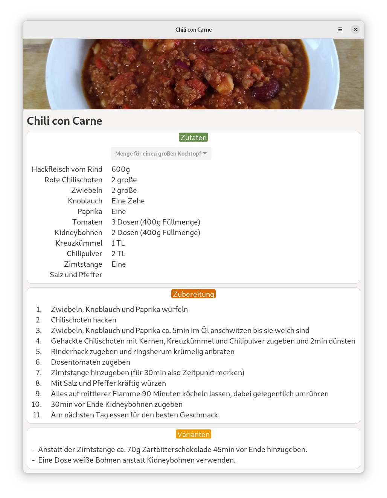

# Yuml Recipes

This is the GNOME application for Yuml Recipes. It opens *.yuml files by registering the application/x-yuml mimetype. Internally it uses the [Yuml Recipes Python Library](https://github.com/yuml-recipes/yuml-recipes-lib).

## Preview

## Setup

- Run `./build` to build and verify
- Run `./export` to create the *.flatpak
- Run `./run` to start the application

## Hints

### Open by mimetype from console

Run `xdg-open filename.yuml` to get console output.

## Links

- [GTK4 Widget Documentation](https://docs.gtk.org/gtk4/index.html)

## License

GNU GENERAL PUBLIC LICENSE Version 3, 29 June 2007

GPL-3.0

Copyright (c) 2022 Patrick Eschenbach

